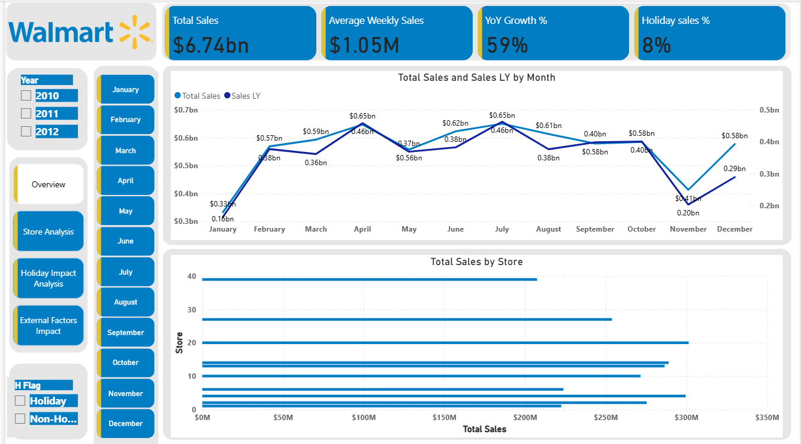
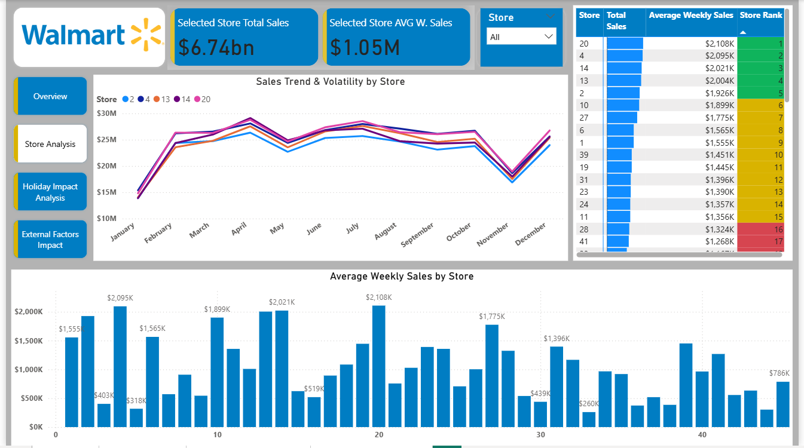

# 📊 Walmart Sales Analysis – Power BI Dashboard

## 📌 Overview
This Power BI dashboard analyzes Walmart sales data across multiple stores and years.
The analysis focuses on **sales trends, store performance, holiday impact, and external economic factors**.
This project is designed from a **business and sales perspective**, aligning with real-world decision-making.

---

## 🛠 Tools & Skills Used
- Power BI
- DAX
- Power Query (Data Cleaning & Modeling)
- SQL (Data Understanding)
- Advanced Excel

---

## 📈 Key Metrics
- Total Sales: **$6.74B**
- Average Weekly Sales: **$1.05M**
- YoY Growth: **59%**
- Holiday Sales Contribution: **~7–8%**

---

## 📂 Dashboard Pages

### 1️⃣ Overview

### 2️⃣ Store Analysis

### 3️⃣ Holiday Impact Analysis

### 4️⃣ External Factors Impact

---

## 📁 Files Included

- 📊 **Power BI File:**  
  👉 👉 [Download Walmart_Sales_Analysis.pbix]https://github.com/TufailAnalytics/PowerBI-walmart-sales-analysis/raw/refs/heads/main/screenshots/Walmart_Sales_Analysis.pbix

- 🖼 **Dashboard Screenshots:**  
  `screenshots/`

## 🚀 How to Use
1. Download the `.pbix` file
2. Open using **Power BI Desktop**
3. Use slicers to explore insights

---

## 👤 About Me
**Mohd Tufail**  
Aspiring BI Analyst | Power BI Developer  
6+ years experience in Sales & Insurance Industry

